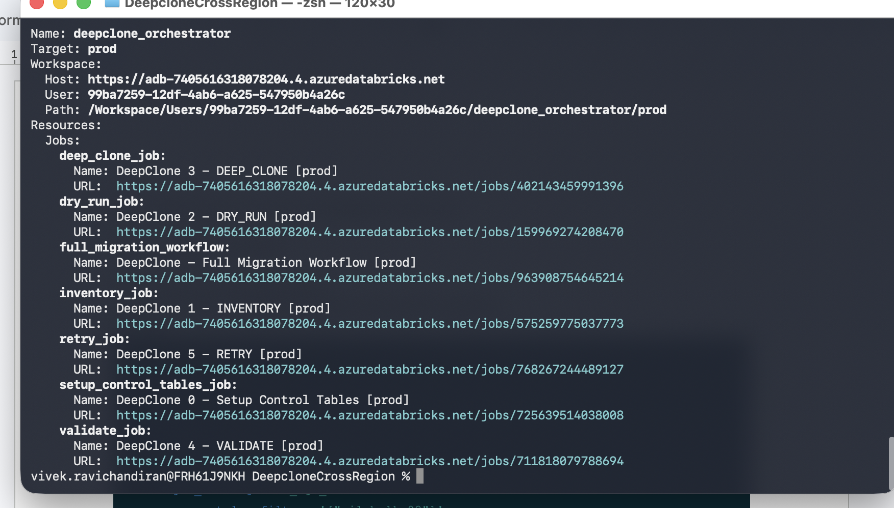
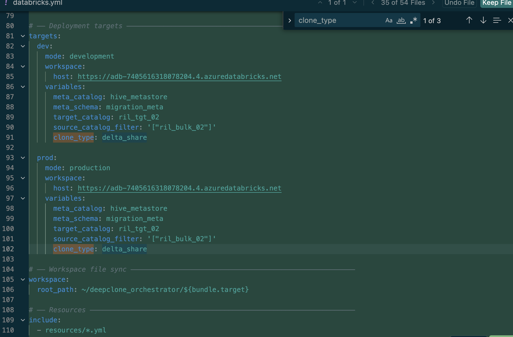
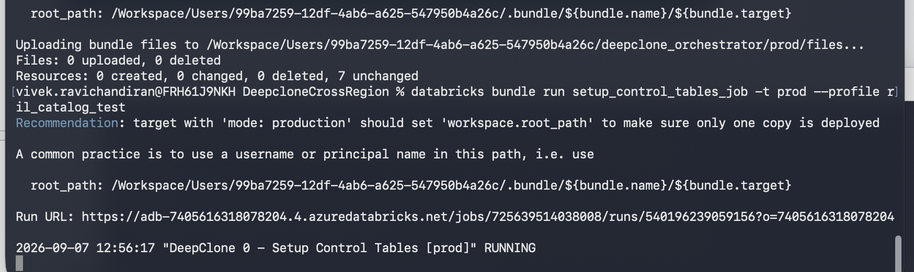
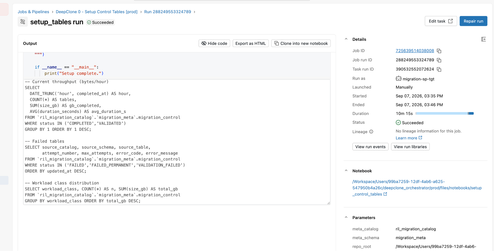
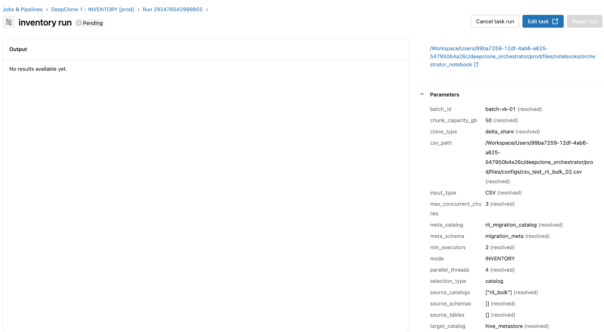
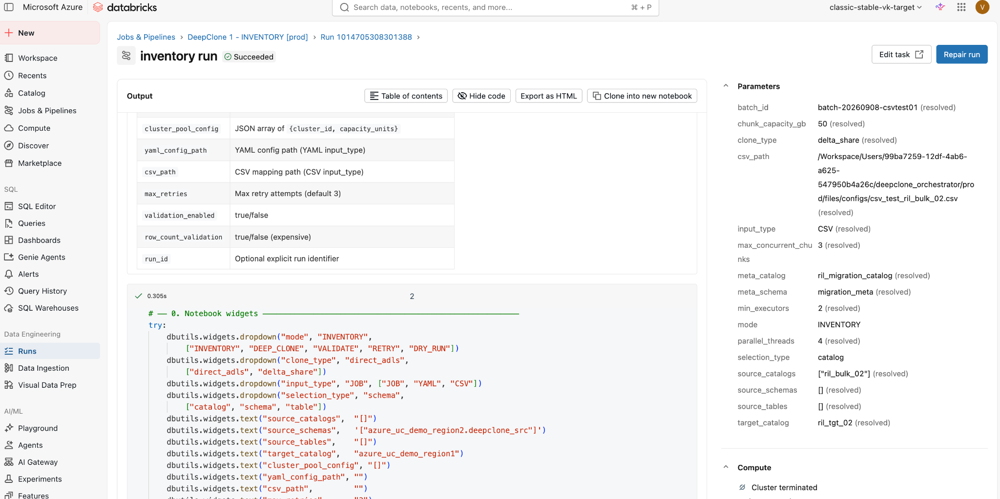
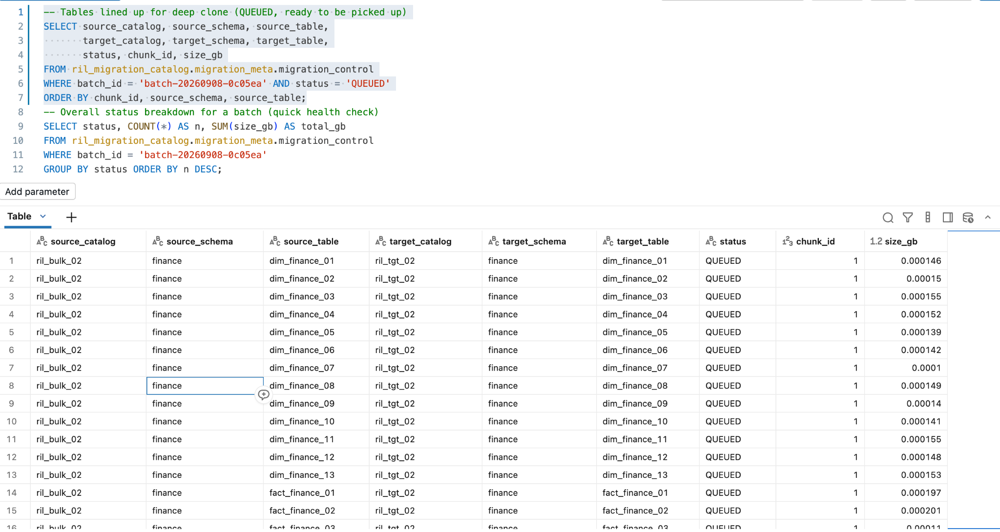
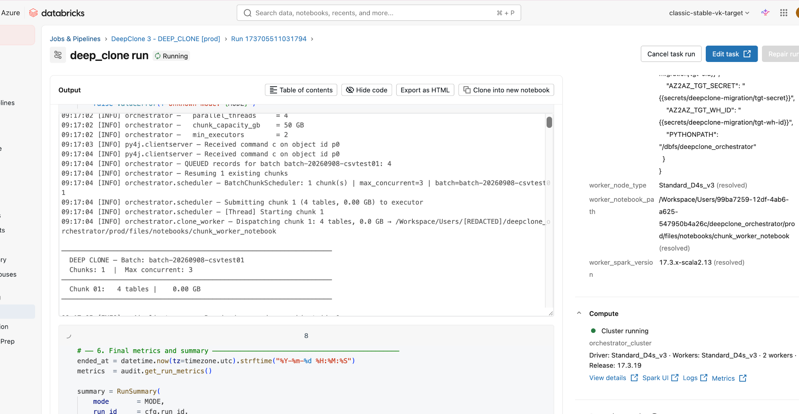
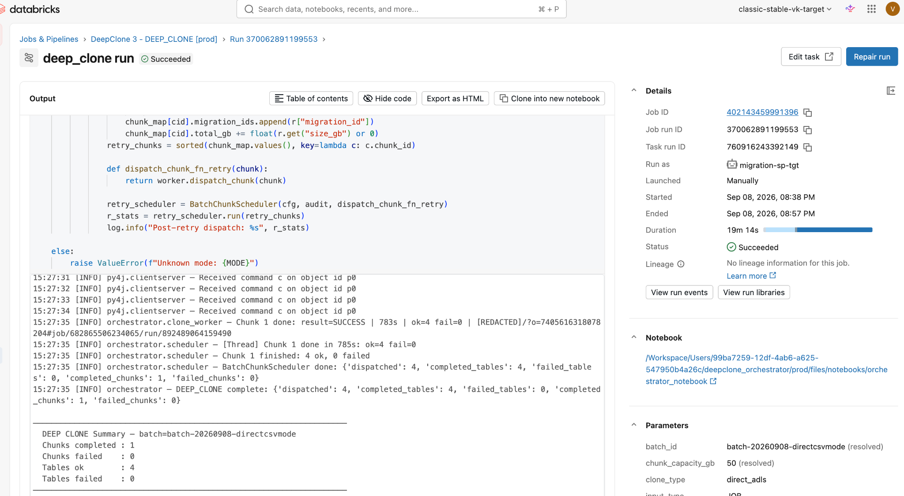
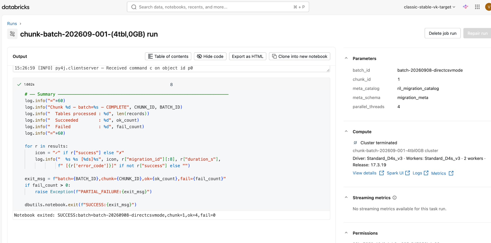

# DeepClone CrossRegion — SOP: Running a CSV-based Migration (`input_type = CSV`, `clone_type = delta_share`)

**Document ID:** SOP-DCR-CSV-01
**Version:** 1.0
**Owner:** Data Platform Engineering
**Applies to bundle:** `deepclone_orchestrator` (`databricks.yml`)
**Classification:** Internal — Data Engineering

---

## Table of Contents

1. [Purpose & Scope](#1-purpose--scope)
2. [Architecture Overview](#2-architecture-overview)
3. [Prerequisites](#3-prerequisites)
4. [Step 1 — Prepare the CSV table-mapping file](#step-1--prepare-the-csv-table-mapping-file)
5. [Step 2 — Point `databricks.yml` at your CSV](#step-2--point-databricksyml-at-your-csv)
6. [Step 3 — Deploy the bundle](#step-3--deploy-the-bundle)
7. [Step 4 — One-time setup: create control tables](#step-4--one-time-setup-create-control-tables)
8. [Step 5 — Run INVENTORY](#step-5--run-inventory)
9. [Step 6 — Verify queued tables](#step-6--verify-queued-tables)
10. [Step 7 — Run DEEP_CLONE](#step-7--run-deep_clone)
11. [Step 8 — Monitor the chunk-worker cluster](#step-8--monitor-the-chunk-worker-cluster)
12. [Step 9 — Run VALIDATE](#step-9--run-validate)
13. [Step 10 — Review audit results / sign-off](#step-10--review-audit-results--sign-off)
14. [One-shot alternative: `full_migration_workflow`](#14-one-shot-alternative-full_migration_workflow)
15. [Troubleshooting & Gotchas](#15-troubleshooting--gotchas)
16. [Cleanup / Re-running a batch](#16-cleanup--re-running-a-batch)
17. [Reference: Job IDs & Query Cheat-Sheet](#17-reference-job-ids--query-cheat-sheet)
18. [Change Log](#18-change-log)

---

## 1. Purpose & Scope

This SOP describes the exact, verified procedure to migrate a **hand-picked list of tables** from a source catalog to a target catalog using:

- **`input_type: CSV`** — the table list comes from a CSV file (`source_catalog,source_schema,source_table,target_catalog,target_schema,target_table`), instead of a YAML config or catalog/schema/table job filters.
- **`clone_type: delta_share`** — the DEEP CLONE statement runs `CREATE OR REPLACE TABLE <target_fqn> DEEP CLONE <source_fqn>`, referencing the source table by its UC three-part name (used when the source is reachable directly or via Delta Sharing, as opposed to `direct_adls` which clones from a raw `abfss://` path).

This is the fastest onboarding path for **ad-hoc / curated table lists** (a handful of tables, a cherry-picked back-fill, a one-off DR copy) — no YAML editing, no catalog/schema filter logic, just a flat CSV.

**Out of scope:** YAML-mode and JOB-mode onboarding (see `docs/SOP_Onboarding.md` for the legacy/general SOP), initial workspace/network setup, Unity Catalog metastore creation.

---

## 2. Architecture Overview

The bundle deploys 7 jobs. A CSV run only touches **INVENTORY → DEEP_CLONE → VALIDATE** (RETRY is automatic/on-demand; the `full_migration_workflow` job chains all of them — see §14).


*`databricks bundle summary` — every job this SOP references, with its job ID and Jobs UI URL.*

| Job | Purpose |
|---|---|
| `setup_control_tables_job` | One-time DDL: creates `migration_control`, `migration_attempts`, `migration_validation_history` |
| `inventory_job` | Reads the CSV (or YAML/catalog filters), onboards rows into `migration_control` as `QUEUED`, bin-packs them into chunks |
| `deep_clone_job` | Dispatches one ephemeral cluster per chunk; each cluster runs the `DEEP CLONE` SQL for its assigned tables |
| `validate_job` | Compares source vs. target (size, file count, Delta version, row count) for `COMPLETED` rows and marks `VALIDATED`/`VALIDATION_FAILED` |
| `retry_job` | Re-queues `FAILED` / `RETRY_PENDING` / `VALIDATION_FAILED` rows (below `max_attempts`) and re-dispatches them |
| `full_migration_workflow` | One job that chains INVENTORY → DRY_RUN → DEEP_CLONE → RETRY → VALIDATE for a single `run-now` |

Everything is scoped by **`batch_id`** — the isolation key. Every table row in `migration_control` carries the `batch_id` of the run that onboarded it, so multiple teams/loads can run in parallel without interfering, and you always filter your audit queries by `batch_id`.

---

## 3. Prerequisites

| # | Requirement | How to verify |
|---|---|---|
| 1 | Bundle already deployed at least once (`databricks bundle deploy -t prod --profile <profile>`) | `databricks bundle summary -t prod --profile <profile>` |
| 2 | `setup_control_tables_job` has been run at least once against the target `meta_catalog.meta_schema` | `SHOW TABLES IN <meta_catalog>.<meta_schema>` → `migration_control`, `migration_attempts`, `migration_validation_history` exist |
| 3 | Source tables are Delta tables, visible to the target workspace (same metastore or via Delta Sharing) | `DESCRIBE DETAIL <source_catalog>.<source_schema>.<source_table>` succeeds from the target workspace |
| 4 | Target catalog/schema exist, or the run's service principal can create them | `SHOW GRANTS ON CATALOG <target_catalog>` |
| 5 | Instance pool configured in `databricks.yml` (`instance_pool_id`) is warm/available | Databricks UI → Compute → Instance Pools |
| 6 | `databricks` CLI configured with a working profile | `databricks bundle validate -t prod --profile <profile>` |

---

## Step 1 — Prepare the CSV table-mapping file

Create a CSV under `configs/` with **exactly** this header (target columns are optional — omit them to default to the same name as source):

```csv
source_catalog,source_schema,source_table,target_catalog,target_schema,target_table
ril_bulk_02,iot,dim_iot_01,ril_tgt_02,iot,dim_iot_01
ril_bulk_02,iot,dim_iot_02,ril_tgt_02,iot,dim_iot_02
ril_bulk_02,marketing,dim_marketing_01,ril_tgt_02,marketing,dim_marketing_01
ril_bulk_02,marketing,dim_marketing_02,ril_tgt_02,marketing,dim_marketing_02
```

Parsed by `InputResolver._resolve_csv()` in `orchestrator/input_resolver.py` — one row per table, no wildcards.

> Tip: keep one CSV per logical load (e.g. `csv_<team>_<date>.csv`) so you can tell at a glance what a batch contains.

---

## Step 2 — Point `databricks.yml` at your CSV

Edit the `variables:` block near the top of `databricks.yml` — **3 fields**, no other file needs to change:

```yaml
variables:
  csv_path:
    default: "${workspace.file_path}/configs/<your_file>.csv"
  clone_type:
    default: "delta_share"
  input_type:
    default: "CSV"     # optional / cosmetic — see note below
```


*Example: setting `clone_type: delta_share` for a target in `databricks.yml`. In the current single-file layout, `clone_type` and `csv_path` live under the top-level `variables:` block (not per-target) — set them once, they apply to whichever target you deploy.*

**Rules that matter:**

- **`csv_path` wins over `yaml_config_path` automatically.** The notebook auto-detects `input_type` from whichever path is non-blank (`csv_path` checked first) — see `orchestrator_notebook.py`'s `_Params.effective_input_path`. You do **not** need to blank out `yaml_config_path`; leave it alone.
- **`clone_type: delta_share` must be set** for CSV+delta_share runs. If left blank, `OrchestratorConfig` falls back to `direct_adls` for CSV/JOB mode.
- **Do not set `target_catalog` / `source_catalog_filter` / `source_schema_filter` / `source_table_filter`** to control this run — those are JOB-mode-only variables and are silently ignored once `input_type` resolves to CSV. All source/target info comes from the CSV file itself.

---

## Step 3 — Deploy the bundle

```bash
databricks bundle deploy -t prod --profile <profile>
```

Confirm the deployed job parameters actually picked up your values:

```bash
databricks jobs get <inventory_job_id> --profile <profile> --output json \
  | jq -r '.settings.parameters[] | select(.name=="input_type" or .name=="csv_path" or .name=="clone_type")'
```

Expected: `input_type=CSV`, `csv_path=.../configs/<your_file>.csv`, `clone_type=delta_share`.

---

## Step 4 — One-time setup: create control tables

Skip if `migration_control` / `migration_attempts` / `migration_validation_history` already exist in your `meta_catalog.meta_schema`.

```bash
databricks bundle run setup_control_tables_job -t prod --profile <profile>
```


*Deploy + run from the terminal. Note the Run URL printed — click through to watch it in the UI.*


*The Databricks UI run detail — DDL output plus useful monitoring query templates (throughput, failed tables, workload distribution) printed at the bottom of the notebook.*

---

## Step 5 — Run INVENTORY

This discovers/validates every row in your CSV and inserts it into `migration_control` as `QUEUED`, then bin-packs the queued rows into chunks (`chunk_capacity_gb`, default 50–500 GB per chunk depending on target).

```bash
databricks jobs run-now --profile <profile> --json '{
  "job_id": <inventory_job_id>,
  "job_parameters": {"batch_id": "<your-new-batch-id>"}
}'
```

> Pick a fresh, descriptive `batch_id` — it's the isolation key. Don't reuse someone else's test batch.


*Right-hand Parameters panel on the run page confirms the **resolved** values actually used for this run — always double-check `input_type`, `csv_path`, and `clone_type` here before trusting the run.*


*A completed INVENTORY run. `input_type: CSV (resolved)`, `clone_type: delta_share (resolved)`, `csv_path` pointing at the deployed CSV file under `.../files/configs/...`.*

---

## Step 6 — Verify queued tables

```sql
-- Tables lined up for deep clone (QUEUED, ready to be picked up)
SELECT source_catalog, source_schema, source_table,
       target_catalog, target_schema, target_table,
       status, chunk_id, size_gb
FROM `<meta_catalog>`.`<meta_schema>`.migration_control
WHERE batch_id = '<your-new-batch-id>'
ORDER BY chunk_id, source_schema, source_table;
```


*All rows should show `status = QUEUED` with a `chunk_id` assigned and no `error_code`. If a row shows a different status or has stale error fields, re-run INVENTORY — the upsert logic resets `started_at`/`error_code`/etc. on re-onboarding.*

**Sign-off before proceeding:** every row you expect from the CSV is present, `status = QUEUED`, `error_code IS NULL`.

---

## Step 7 — Run DEEP_CLONE

Same `batch_id` as Step 5:

```bash
databricks jobs run-now --profile <profile> --json '{
  "job_id": <deep_clone_job_id>,
  "job_parameters": {"batch_id": "<your-new-batch-id>"}
}'
```


*Live notebook output: `QUEUED records for batch <id>: N`, chunk bin-packing summary, then `Dispatching chunk 1: N tables ... → chunk_worker_notebook`. Each chunk is dispatched as its own one-time job run on an instance-pool-backed cluster.*


*Completed run — `DEEP CLONE Summary`: chunks completed, chunks failed, tables ok, tables failed. The job **fails loudly** (raises `RuntimeError`) if any chunk/table failed, so a green "Succeeded" here means everything actually cloned — it won't silently report success on partial failure.*

---

## Step 8 — Monitor the chunk-worker cluster

Each chunk is its own job run (linked from the DEEP_CLONE log above, or via `Compute → <job_run_id>`). It executes the actual `DEEP CLONE` SQL for its assigned tables directly on Spark.


*Per-table pass/fail summary, then `Notebook exited: SUCCESS:batch=<id>,chunk=<n>,ok=<n>,fail=0`. If `fail_count > 0` the chunk raises `PARTIAL_FAILURE`, which propagates back up and fails the parent DEEP_CLONE task.*

---

## Step 9 — Run VALIDATE

```bash
databricks jobs run-now --profile <profile> --json '{
  "job_id": <validate_job_id>,
  "job_parameters": {"batch_id": "<your-new-batch-id>"}
}'
```

VALIDATE checks every `COMPLETED` row for this batch: table size, file count, Delta version, and (if `row_count_validation=true`, the default) row count — counted `VERSION AS OF` the exact `source_version`/`target_version` captured at clone time, so results stay stable even if the source gets new writes afterward. Results are written both to `migration_control` (latest) and to the append-only `migration_validation_history` audit table.

---

## Step 10 — Review audit results / sign-off

```sql
-- Final status for the batch
SELECT status, COUNT(*) AS n, SUM(size_gb) AS total_gb
FROM `<meta_catalog>`.`<meta_schema>`.migration_control
WHERE batch_id = '<your-new-batch-id>'
GROUP BY status ORDER BY n DESC;

-- Row-count validation detail (per table, from the audit trail)
SELECT source_table, source_version, target_version,
       source_row_count, target_row_count, row_count_matched, status
FROM `<meta_catalog>`.`<meta_schema>`.migration_validation_history
WHERE batch_id = '<your-new-batch-id>'
ORDER BY source_table;
```

**Acceptance criteria:** every row `status = VALIDATED`, `row_count_matched = true` (or `NULL` only if you deliberately disabled `row_count_validation`). Any `VALIDATION_FAILED` or count mismatch is a blocker — investigate before signing off.

---

## 14. One-shot alternative: `full_migration_workflow`

For a single `run-now` that chains INVENTORY → DRY_RUN → DEEP_CLONE → RETRY → VALIDATE automatically (Steps 5–9 above in one job), use:

```bash
databricks jobs run-now --profile <profile> --json '{
  "job_id": <full_migration_workflow_job_id>,
  "job_parameters": {"batch_id": "<your-new-batch-id>"}
}'
```

It reads the same `input_type`/`csv_path`/`clone_type` bundle variables as the standalone INVENTORY job — no extra configuration needed. Poll with `databricks jobs get-run <run_id>` until every task shows `TERMINATED / SUCCESS`.

---

## 15. Troubleshooting & Gotchas

### G1: `repair-run` silently drops your `batch_id`
If a task in the workflow fails and you `databricks jobs repair-run` to retry just that task, **you must re-pass `job_parameters` explicitly** in the repair call:

```bash
databricks jobs repair-run --profile <profile> --json '{
  "run_id": <run_id>,
  "rerun_tasks": ["deep_clone"],
  "job_parameters": {"batch_id": "<your-batch-id>"}
}'
```

Without this, the repaired task falls back to the job's blank default `batch_id`, silently auto-generates a random phantom batch, finds 0 `QUEUED` rows for it, and reports a false `SUCCESS` while doing nothing. **When in doubt, trigger a fresh `run-now` instead** — it's idempotent (re-running INVENTORY for the same source/target FQNs reuses the same `migration_id`, just resets status to `QUEUED`).

### G2: "Inventory shows 0 tables" after switching to CSV
Almost always one of:
- `csv_path` resolved to a doubled/relative path (e.g. a YAML file's own `csv_path:` field is relative to *that YAML's* directory, not the repo root) — use the full bundle-deployed path.
- `yaml_config_path` was non-blank and took precedence unexpectedly — check `effective_input_path` in the INVENTORY log line `Input: type=... effective_input_path=...`.

### G3: `clone_type` shows `direct_adls` in the UI even though the CSV/YAML says `delta_share`
Check the **Parameters panel `(resolved)` value**, not just what you typed in the config — `cfg.clone_type` is only overridden by the job parameter when `input_type != YAML`. For CSV mode, `databricks.yml`'s `clone_type` variable **is** applied, so make sure it's set to `delta_share` there (Step 2). VALIDATE additionally needs `clone_type` wired into its own job parameters (already done in `04_validate_job.yml` / `06_full_migration_workflow.yml`) — for `delta_share`, VALIDATE reads "source" data via the **target** SQL client, since delta-shared tables are visible there.

### G4: DEEP_CLONE/RETRY fail immediately with an OIDC/token error
These modes never need the **source** SQL warehouse (chunk workers run `DEEP CLONE` directly via Spark, not the REST SQL client) — the orchestrator notebook skips starting it for `DEEP_CLONE`/`RETRY`, or for any mode when `clone_type=delta_share`. If you see this error on a fresh code checkout, redeploy — this is fixed in the current `orchestrator_notebook.py`.

### G5: Chunk cluster not using the instance pool
Confirm `worker_cluster_json`'s `instance_pool_id` in the relevant job YAML (`03_deep_clone_job.yml`, `05_retry_job.yml`, `06_full_migration_workflow.yml`) matches `databricks.yml`'s `instance_pool_id` variable, and redeploy. Verify on an actual chunk run via:

```bash
databricks api get "/api/2.1/jobs/runs/get?run_id=<chunk_run_id>" --profile <profile> \
  | jq '.tasks[0].new_cluster.instance_pool_id'
```

---

## 16. Cleanup / Re-running a batch

To wipe a batch and start over (e.g. a bad test run):

```sql
DELETE FROM `<meta_catalog>`.`<meta_schema>`.migration_control WHERE batch_id = '<batch_id>';
DELETE FROM `<meta_catalog>`.`<meta_schema>`.migration_attempts a
  WHERE NOT EXISTS (SELECT 1 FROM `<meta_catalog>`.`<meta_schema>`.migration_control c WHERE c.migration_id = a.migration_id);
```

To simply re-queue an existing batch without deleting history:

```sql
UPDATE `<meta_catalog>`.`<meta_schema>`.migration_control
SET status = 'QUEUED', attempt_number = 0,
    started_at = NULL, completed_at = NULL, failed_at = NULL,
    error_code = NULL, error_message = NULL,
    validation_status = NULL, validation_message = NULL
WHERE batch_id = '<batch_id>';
```

Then re-run DEEP_CLONE (Step 7) — target tables are cloned with `CREATE OR REPLACE TABLE`, so re-running is safe.

---

## 17. Reference: Job IDs & Query Cheat-Sheet

> Job IDs are environment-specific — always re-confirm with `databricks bundle summary -t prod --profile <profile>` (see the screenshot in §2). Example IDs from the `prod` target at time of writing:

| Job | Example Job ID |
|---|---|
| `setup_control_tables_job` | 725639514038008 |
| `inventory_job` | 575259775037773 |
| `dry_run_job` | 159969274208470 |
| `deep_clone_job` | 402143459991396 |
| `validate_job` | 711818079788694 |
| `retry_job` | 768267244489127 |
| `full_migration_workflow` | 963908754645214 |

```sql
-- Failed tables with error context
SELECT source_catalog, source_schema, source_table,
       attempt_number, max_attempts, error_code, error_message
FROM `<meta_catalog>`.`<meta_schema>`.migration_control
WHERE status IN ('FAILED','FAILED_PERMANENT','VALIDATION_FAILED')
ORDER BY updated_at DESC;

-- Attempt-level history for a specific table (debugging retries/failures)
SELECT a.* FROM `<meta_catalog>`.`<meta_schema>`.migration_attempts a
JOIN `<meta_catalog>`.`<meta_schema>`.migration_control c
  ON a.migration_id = c.migration_id
WHERE c.source_table = '<table_name>'
ORDER BY a.attempt_number;

-- Current throughput (bytes/hour)
SELECT DATE_TRUNC('hour', completed_at) AS hour,
       COUNT(*) AS tables, SUM(size_gb) AS gb_completed,
       AVG(duration_seconds) AS avg_duration_s
FROM `<meta_catalog>`.`<meta_schema>`.migration_control
WHERE status IN ('COMPLETED','VALIDATED')
GROUP BY 1 ORDER BY 1 DESC;
```

---

## 18. Change Log

| Version | Date | Author | Change |
|---|---|---|---|
| 1.0 | 2026-09-09 | Data Platform Engineering | Initial CSV-run SOP, with screenshots from the verified end-to-end run on `ril_bulk_02` → `ril_tgt_02` (`clone_type=delta_share`) |

---

*For questions or exceptions to this SOP, contact the Data Platform Engineering team via your internal ticketing system.*
